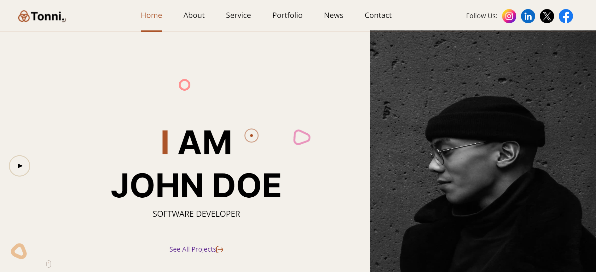
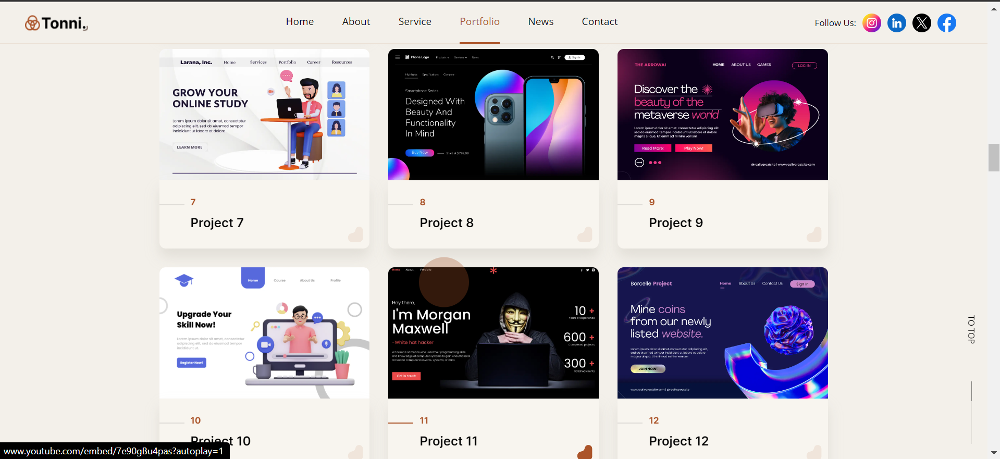

Creating a README.md file for your project is a great idea to provide information about the project, its purpose, features, and how to use it. Here's a template you can use:

---

# Project Name

## Description

This project was completed as part of an internship with Theportfolyo company on Internshala. It was an enriching experience, and I learned a lot while working on it.

## Screenshots

## Usage

To use this project, follow these steps:

1. Clone the repository: `git clone https://github.com/Roshnnnnn/ThePortfolyo.git`
2. Navigate to the project directory: `cd project-name`

## Credits

This project was created by Roshan Kumar Yadav. Special thanks to The POrtfolyo for the opportunity and support during the internship.

## License

This project is licensed under the [License Name] License - see the [LICENSE](LICENSE) file for details.

---

Replace the placeholders with actual content relevant to your project. You can also add more sections or customize it further based on your project's specifics. Make sure to include proper attribution and license information if applicable.
